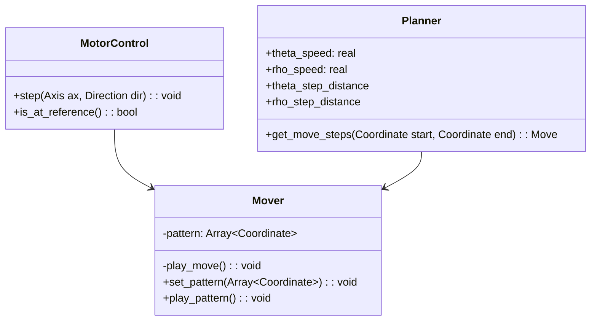
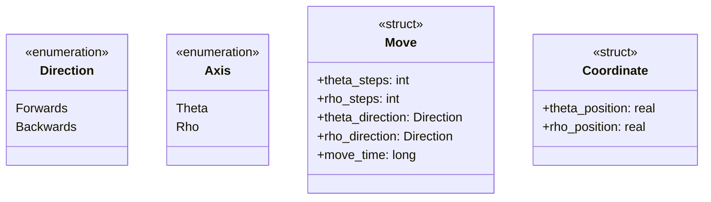
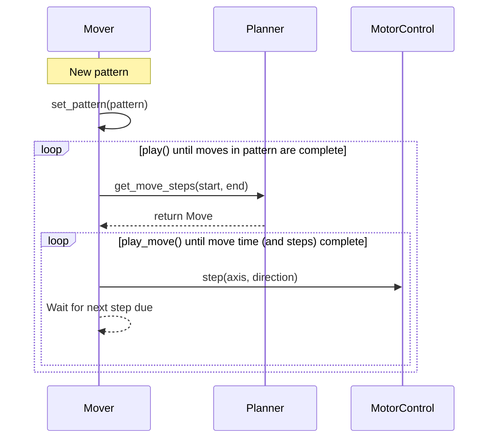

# Software design

## Class diagram

### Classes

```mermaid
classDiagram
    class MotorControl {
        +step(Axis ax, Direction dir): void
        +is_at_reference(): bool
    }

    class Mover {
        -pattern: Array~Coordinate~
        -play_move(): void
        +set_pattern(Array~Coordinate~): void
        +play_pattern(): void
    }

    class Planner {
        +theta_speed: real
        +rho_speed: real
        +theta_step_distance
        +rho_step_distance
        +get_move_steps(Coordinate start, Coordinate end): Move
    }

    MotorControl --> Mover
    Planner --> Mover
```

### Structs and Enums

```mermaid
classDiagram
    class Direction {
        <<enumeration>>
        Forwards
        Backwards
    }

    class Axis {
        <<enumeration>>
        Theta
        Rho
    }

    class Move {
        <<struct>>
        +theta_steps: int
        +rho_steps: int
        +theta_direction: Direction
        +rho_direction: Direction
        +move_time: long
    }

    class Coordinate {
        <<struct>>
        +theta_position: real
        +rho_position: real
    }
```

## Example call sequence to play pattern

```mermaid
sequenceDiagram
    note over Mover: New pattern
    Mover->>Mover: set_pattern(pattern)
    loop play() until moves in pattern are complete
        Mover->>Planner: get_move_steps(start, end)
        Planner-->>Mover: return Move
        loop play_move() until move time (and steps) complete
            Mover->>MotorControl: step(axis, direction)
            Mover-->>Mover: Wait for next step due
        end
    end
```