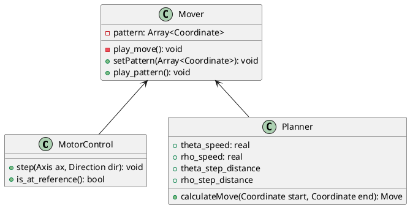
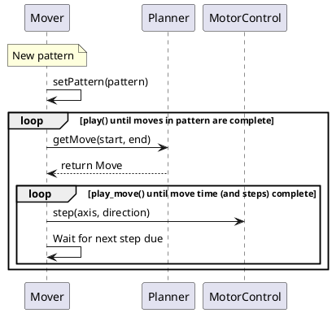

# Software design

## Class diagram

### Classes



### Structs and Enums

```plantuml
enum Direction {
Forwards
Backwards
}

enum Axis {
Theta
Rho
}

struct Move {
+ theta_steps: int
+ rho_steps: int
+ theta_direction: Direction
+ rho_direction: Direction
+ move_time: long
}

struct Coordinate {
+ theta_position: real
+ rho_position: real
}
```


## Example call sequence to play pattern

